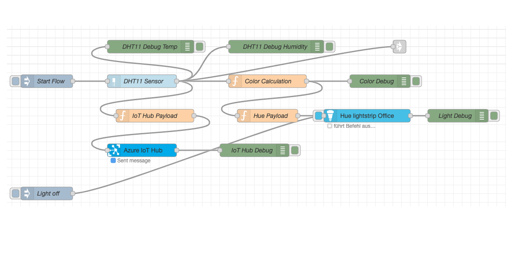
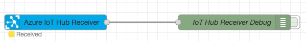
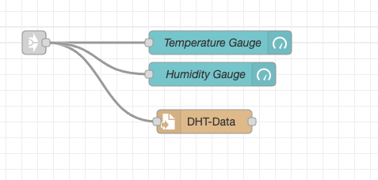
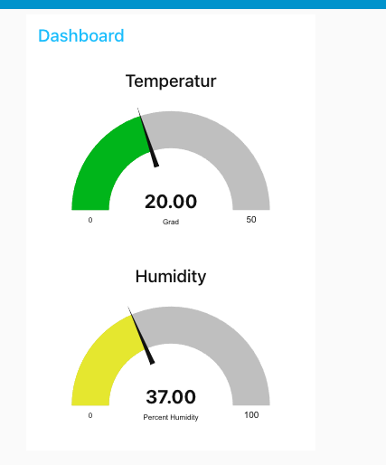

# Node-Red on Raspberry Pi 4B

## Start Node-Red
```bash
node-red start
```

## Flows

### Raspberry Pi Flow
- Trigger: Start complete Flow
  - Read temperature and humidity from DHT11 sensor
  - Calculate color and control Philipps Hue Light
  - Send data to Azure Iot Hub
  - Start Dashboard UI Flow
  - Debug Logging
- Optional Trigger:
  - Turn off Philipps Hue Light



### Azure Iot Hub Receiver Flow
- Receive all data which is sent to Azure Iot Hub



### Dashboard UI Flow
- Temperature Gauge Diagram
- Humidity Gauge Diagram
- Store data in File on Raspberry




## Dashboard


